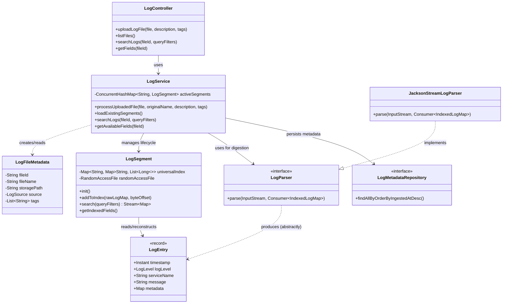
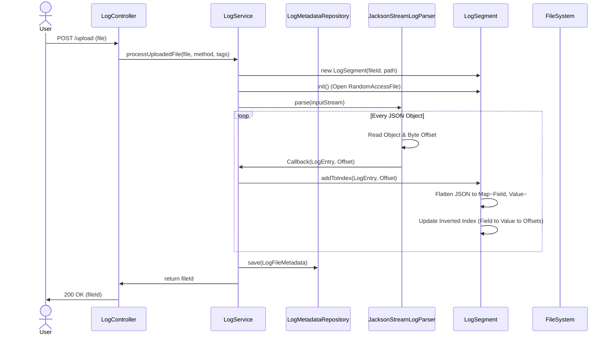
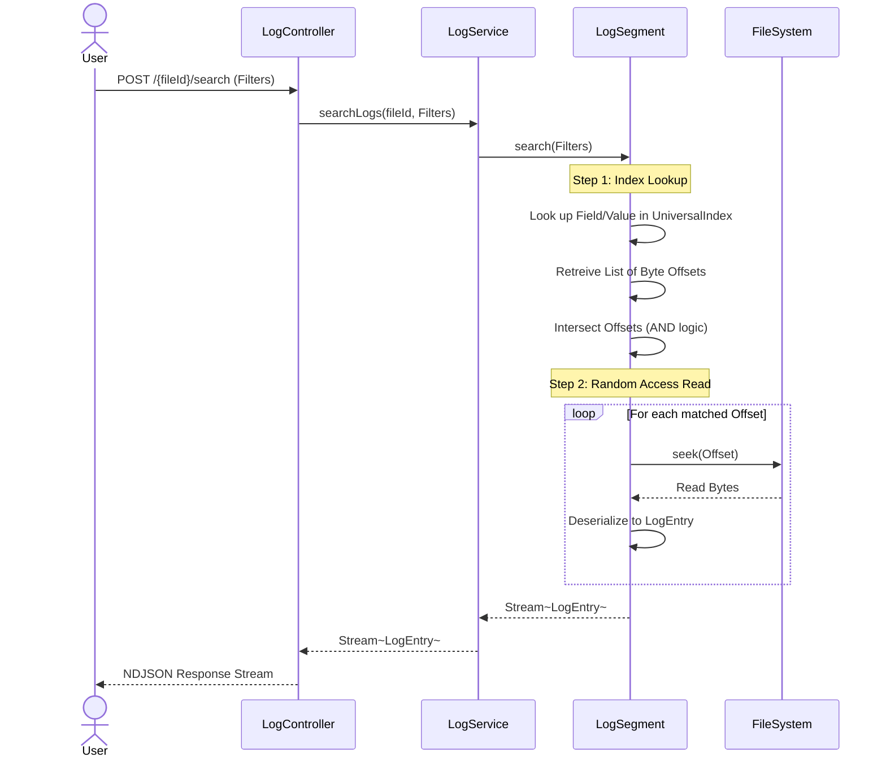
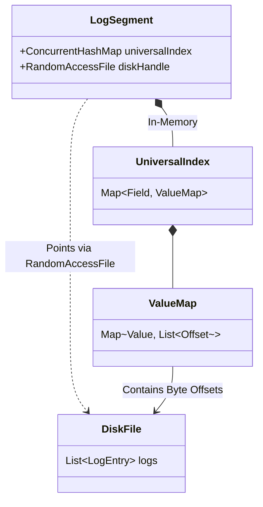

# Backend Methodology & Diagrams

This document contains architectural diagrams for the Log Explorer backend, generated from the source code.

## 1. Class Diagram
High-level overview of the system components and their relationships.

## 2. Sequence Diagram: File Upload & Ingestion
The flow when a user uploads a new log file.

## 3. Sequence Diagram: Search
The flow when a user searches for logs.

## 4. Storage & Indexing Structure
Conceptual view of how `LogSegment` organizes data in memory vs on disk.

